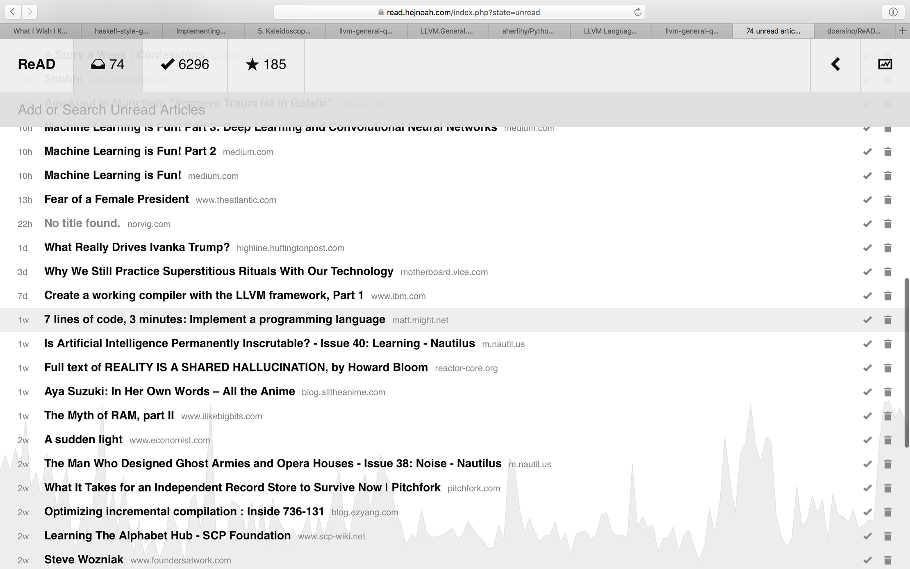
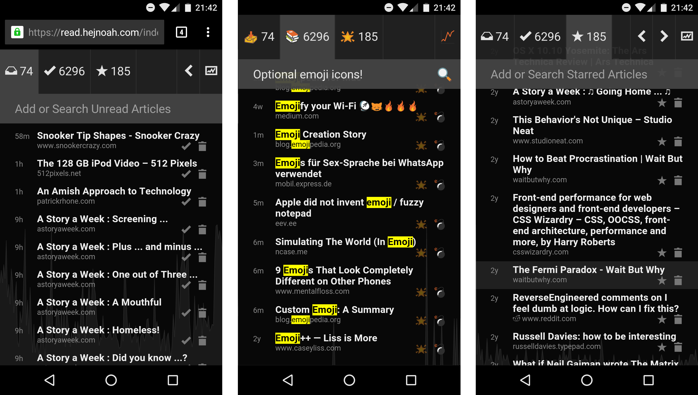
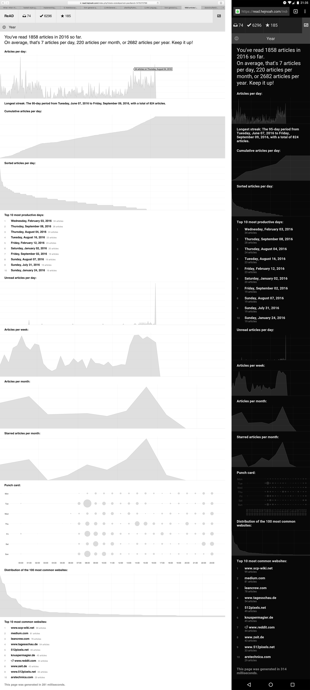

A simple, responsive web app enabling you to

1. keep a **reading list** (of links to articles you're planning to read),
2. maintain a **searchable archive** of articles you've read, along with a list of favorites,
3. and **analyze when, what, and how much** you've read in a given time period.

## Screenshots

<!-- As of September 9, 2016. -->

## Setup

1. **Clone** this repository to a web server running PHP 7.2 or later and a recent version of MySQL/MariaDB.
2. **Import** `setup/import.sql` into some database.
3. Copy `setup/config.php.example` to `config.php` and **enter your database info**. If you want to keep things private (recommended), **set a password**.

That's it, your ReAD install should now be accessible via any web browser! Consider the following optional steps as well:

* Take a look at the **other config options** and tune them to taste: most notably, enter [your reading speed](http://www.readingsoft.com) for more accurate reading time estimates. Also, setting `ARTICLES_PER_TIME_GRAPH_STEP_SIZE = "weeks";` might be more interesting after a few months.
* You could add `<your base URL>/index.php?state=archived&s=<search query placeholder>` as a new search engine in your browser (substitute `archived` with `unread` or `starred` depending on your primary use case).
* If you don't trust my homegrown authentication mechanism (and why would you), I won't fault you for [using `.htaccess`](http://stackoverflow.com/a/5229803)) or similar.

## Notes

* *Regarding the name:* Originally, ReAD was supposed to be called "RAD", but since that'd be too silly, I snuck an "e" in there. It also makes for an excellent and only very hubristic [NeXT](https://en.wikipedia.org/wiki/NeXT) reference.
* The font used in the logo is [Iosevka](https://github.com/be5invis/Iosevka), with a minor modification of the letter "e" to keep its terminal socially distanced from the adjacent "A".
* The graph at the bottom of every page, as well as the statistics page, won't become very useful until you've been using ReAD for a while.
* You can log out by simply appending `&logout` to any URL – in my own use (see next point), this action is too uncommon to warrant a UI element.
* Similarly hidden is a (very) simple API – once your set the `API_KEY` constant in `config.php`, you can add articles by requesting `api.php?key=<key>&action=add_unread&url=<url>`, which returns a JSON value indicating success of failure. My impetus for adding this API was the release of iOS 12 and the [Shortcuts](https://itunes.apple.com/us/app/shortcuts/id915249334) app, where I defined a shortcut that takes the clipboard content (unless the shortcut has received a direct input) and, if it turns out to be a URL, calls the API to add the URL to my ReAD instance. You can find this shortcut as `utils/Add to ReAD.shortcut`.
* Note that I'm the only known active (but very much so) user of this thing, so improvements and bug fixes will be implemented whenever I find time and motivation. For a rough roadmap, see [TODO.md](https://github.com/doersino/ReAD/blob/master/TODO.md).
* This tool was born out of my despair at the demise of [QUOTE.fm](https://vimeo.com/44251833), paired with my discontent with existing services aiming to solve the same problem.
* The [license](https://github.com/doersino/ReAD/blob/master/LICENSE) does **not** apply to files in the `deps/` directory: those are used with permission and come with their own licenses, which are usually noted at the the top of each file or in a central `LICENSE` file.
